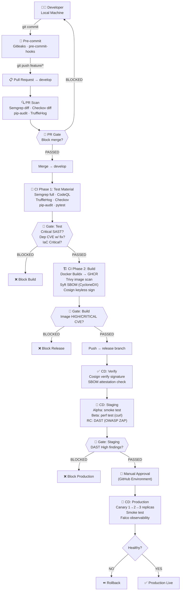

# Shift Left Security in CI/CD Pipeline

> **Demo target:** [Damn Vulnerable RESTaurant API Game](https://github.com/OWASP/Damn-Vulnerable-RESTaurant-API-Game) — a deliberately insecure FastAPI application used as the subject of this security-hardened pipeline.

[](https://github.com/biniter1/Damn-Vulnerable-RESTaurant-API-Game/actions/workflows/ci.yml)
[](https://github.com/biniter1/Damn-Vulnerable-RESTaurant-API-Game/actions/workflows/cd.yml)
[](https://github.com/biniter1/Damn-Vulnerable-RESTaurant-API-Game/actions/workflows/pr-scan.yml)
[](https://semgrep.dev)
[](https://codeql.github.com)
[](https://trivy.dev)
[](https://sigstore.dev)
[](https://zaproxy.org)
[](https://falco.org)
[](LICENSE)

---

## Table of Contents

1. [Overview & Motivation](#1-overview--motivation)
2. [Architecture](#2-architecture)
3. [Pipeline Flow & Tool Justification](#3-pipeline-flow--tool-justification)
4. [Security Gates Logic](#4-security-gates-logic)
5. [Experimental Results](#5-experimental-results)
6. [Key Design Decisions](#6-key-design-decisions)
7. [Prerequisites & Setup](#7-prerequisites--setup)
8. [Branch Strategy & Triggering Workflows](#8-branch-strategy--triggering-workflows)
9. [Trade-offs & Limitations](#9-trade-offs--limitations)
10. [Future Improvements](#10-future-improvements)

---

## 1. Overview & Motivation

### What is Shift Left Security?

Traditional security testing happens **late in the development cycle** — often only at the release gate or post-deployment. This creates a compounding cost problem: a vulnerability found in production is [6–100× more expensive to fix](https://www.nist.gov/system/files/documents/director/planning/report02-3.pdf) than one caught during development.

**Shift Left** moves security controls **earlier** in the software delivery process — from the developer's local machine through every stage of the CI/CD pipeline — so that:

- Secrets never leave the workstation.
- Vulnerable code is caught at PR review, not production.
- Insecure container images are blocked before deployment.
- Runtime anomalies are surfaced with observability tools.

### This Project

This repository demonstrates a **production-grade, shift-left CI/CD pipeline** applied to a deliberately vulnerable FastAPI application. Every layer of the delivery process — pre-commit, pull request, CI build, CD staging, and production — has dedicated security controls with explicit, policy-driven **gates** that block progression on real findings.

**Stack:**

| Layer | Technology |
|---|---|
| Application | FastAPI + PostgreSQL (Python 3.10) |
| Containerisation | Docker Buildx, GHCR |
| Orchestration | Kubernetes (kind cluster on AWS EC2) |
| CI/CD | GitHub Actions |
| IaC | Terraform (EC2 provisioning), Ansible (cluster setup) |

---

## 2. Architecture

### High-Level Pipeline Architecture



### Infrastructure Layout

```
┌─────────────────────────────────────────────────────┐
│                    AWS EC2 Instance                  │
│  ┌─────────────────────────────────────────────────┐ │
│  │              kind Kubernetes Cluster             │ │
│  │  ┌──────────────┐    ┌──────────────────────┐  │ │
│  │  │   Staging NS  │    │    Production NS      │  │ │
│  │  │  app (1 pod)  │    │  app (1→2→3 pods)    │  │ │
│  │  │  postgres     │    │  postgres             │  │ │
│  │  └──────────────┘    └──────────────────────┘  │ │
│  │                  Falco (DaemonSet)               │ │
│  └─────────────────────────────────────────────────┘ │
│  GitHub Actions Runner (self-hosted)                 │
└─────────────────────────────────────────────────────┘
          ↑ images pulled from
    ghcr.io/biniter1/nt524_shift_left_in_cicd
```

---

## 3. Pipeline Flow & Tool Justification

### Stage 0 — Pre-commit (Local)

Runs on every `git commit` before code leaves the developer's machine.

| Tool | Why Here |
|---|---|
| **Gitleaks** v8.18.4 | Blocks secrets (API keys, tokens) at the earliest possible point — before they ever touch a remote. Cheaper than rotating leaked credentials. |
| **pre-commit-hooks** v4.6.0 | Catches trivial issues (trailing whitespace, malformed YAML/JSON/TOML, large files, private keys, merge conflict markers) that would clutter PR diffs and waste reviewer time. |

```yaml
# .pre-commit-config.yaml (key hooks)
- gitleaks          # secret scan
- trailing-whitespace
- check-yaml        # (k8s/ excluded — uses custom YAML dialect)
- check-added-large-files --maxkb=500
- detect-private-key
```

---

### Stage 1 — PR Scan (Pull Request → `develop`)

Lightweight, **diff-only** scans that keep PR feedback fast (< 5 min target).

| Tool | Scope | Why Diff-Only |
|---|---|---|
| **Semgrep** | SAST on changed files | Full-repo scan on every PR is expensive and creates noise; diff-only focuses reviewer attention on what *this* PR introduces. |
| **Checkov** | IaC scan on changed files | Same rationale — only flag IaC issues the author can act on now. |
| **pip-audit** | Full dependency tree | Dependencies are holistic — a transitive vuln anywhere matters, regardless of which files changed. |
| **TruffleHog** | Secret scan on diff | Second line of defence after pre-commit; catches secrets committed via `--no-verify` or other bypass. |

The **PR Gate** aggregates findings and posts a summary to the PR. Merge is blocked if thresholds are exceeded (e.g., > 0 secrets, Checkov failures > 5, pip-audit with any CVE with a fix available).

---

### Stage 2 — CI Phase 1: Test Material (push to `develop`)

Full-repository scans run in parallel. Results are uploaded as SARIF to GitHub Security tab.

| Tool | Why Full Scan Here |
|---|---|
| **Semgrep** (full) | Complete picture of all SAST findings in the codebase; catches issues missed by diff-only on long-lived code. |
| **CodeQL** | Deep semantic analysis (data-flow, taint tracking) that Semgrep pattern matching cannot do. Detects SQL injection, path traversal, SSRF chains. |
| **TruffleHog** | Full history scan to catch secrets in old commits that slipped through pre-commit. |
| **Checkov** | Full IaC scan — Dockerfile, k8s manifests, Terraform. |
| **pip-audit** | Dependency CVE check with GHSA and PyPI advisory databases. |
| **pytest** | Functional correctness gate; failing tests mean the artefact should not be built. |

**Gate Test** parses SARIF/JSON outputs directly to count real findings, then blocks the build job if thresholds are exceeded.

---

### Stage 3 — CI Phase 2: Build

Runs only after Gate Test passes.

| Step | Tool | Why |
|---|---|---|
| Build image | **Docker Buildx** | Multi-platform support, layer caching. |
| Push to registry | **GHCR** | Native GitHub integration; free for public repos; supports OCI attestations. |
| Image vulnerability scan | **Trivy** (exact digest) | Scans the *exact pushed digest* — not a locally cached layer — guaranteeing the scan matches what will be deployed. |
| Generate SBOM | **Syft** (CycloneDX) | Machine-readable bill of materials attached as an OCI attestation for downstream audit and licence compliance. |
| Sign image | **Cosign** (keyless) | OIDC-based signing via Fulcio/Rekor — no long-lived signing key to manage or rotate. Signature tied to the GitHub Actions OIDC token. |

**Gate Build** reads the Trivy JSON report and blocks promotion to `release` if any `HIGH` or `CRITICAL` CVE is present in the scanned digest.

---

### Stage 4 — CD: Verify

First job on the `release` branch, runs before any deployment.

| Check | Tool | Why |
|---|---|---|
| Signature verification | **Cosign verify** | Cryptographically confirms the image being deployed is the exact artefact signed in CI. Prevents tampering or image substitution between build and deploy. |
| SBOM attestation check | **Cosign** | Confirms the SBOM attestation is present and valid — required for compliance and licence audit trails. |

If either check fails, the entire CD pipeline is aborted.

---

### Stage 5 — CD: Staging

Three sequential deployment tracks on the staging namespace, each adding confidence before the next:

| Track | Tests | Purpose |
|---|---|---|
| **Alpha** | Smoke test (HTTP health check) | Basic "does it start and respond?" |
| **Beta** | Performance test (curl latency + throughput) | Catches regressions in response time before security testing. |
| **RC** | **OWASP ZAP** DAST scan | Active attack simulation against the running app — SQL injection, XSS, auth bypass, OWASP Top 10. |

**Gate Staging** reads the ZAP JSON report. Any `High` severity alert blocks production promotion. `Medium`/`Low` findings are logged but non-blocking (configurable).

---

### Stage 6 — CD: Production

Manual approval required (GitHub Environment protection rule) before this stage runs.

| Step | Detail |
|---|---|
| Canary rollout | Deploy 1 replica → health check → scale to 2 → health check → scale to 3 |
| Smoke test | HTTP health check against production endpoint |
| Rollback | If any health check fails, immediately scale down and redeploy previous image |
| Observability | **Falco** DaemonSet detects runtime anomalies (unexpected syscalls, privilege escalation, container escapes) |
| Audit | GitHub Step Summary generated for every phase with finding counts and gate decisions |

---

## 4. Security Gates Logic

Gates are the enforcement points that translate security findings into pipeline decisions. A gate that simply checks job exit codes is fragile — a tool can exit 0 with suppressed findings. This pipeline's gates **parse actual artefact outputs**.

```
┌─────────────────────────────────────────────────────────┐
│                   Gate Decision Logic                    │
├─────────────────┬───────────────────────────────────────┤
│ Gate            │ Block Condition                        │
├─────────────────┼───────────────────────────────────────┤
│ PR Gate         │ Secrets found > 0                      │
│                 │ SAST critical findings > 0             │
│                 │ Dep CVEs with available fix > 0        │
│                 │ Checkov failures > 5                   │
├─────────────────┼───────────────────────────────────────┤
│ Gate: Test      │ SAST critical severity > 0             │
│ (CI Phase 1)    │ Dependency CVE w/ fix available > 0   │
│                 │ IaC critical findings > 0              │
│                 │ pytest failures > 0                    │
├─────────────────┼───────────────────────────────────────┤
│ Gate: Build     │ Image CVE HIGH severity > 0            │
│ (CI Phase 2)    │ Image CVE CRITICAL severity > 0        │
├─────────────────┼───────────────────────────────────────┤
│ Gate: Staging   │ DAST findings with severity HIGH > 0  │
│ (CD)            │ Signature/SBOM verification failed     │
└─────────────────┴───────────────────────────────────────┘
```

### Verification Mode vs. Enforcement Mode

Each gate supports two modes controlled by a workflow input:

- **Enforcement mode** (default): gate failure sets job exit code to non-zero, blocking the pipeline.
- **Verification mode** (`bypass_gate: true` via `workflow_dispatch`): gate still runs and reports findings, but does not block. Used for debugging and baselining new tools without interrupting delivery.

This separation allows the pipeline to operate as an **audit trail** even when enforcement is temporarily relaxed during tool onboarding.

---

## 5. Experimental Results

### PR Scan Results

| Scanner | Findings | Gate Decision |
|---|---|---|
| Semgrep (diff) | 3 medium findings | WARN |
| TruffleHog | 0 secrets | PASS |
| **pip-audit** | **70 CVEs detected** (transitive dependencies) | **BLOCKED** |
| Checkov (diff) | 2 failures | PASS (< threshold of 5) |
| **Overall PR Gate** | — | **❌ MERGE BLOCKED** |

> **Note:** The 70 CVEs originate from the deliberately vulnerable demo application's outdated dependencies. This is the expected outcome — the gate correctly prevents merging insecure code.

---

### CI Results

| Phase | Tool | Result | Detail |
|---|---|---|---|
| Phase 1 | Semgrep (full) | 8 findings | No critical severity |
| Phase 1 | CodeQL | 4 findings | No critical severity |
| Phase 1 | TruffleHog | 0 secrets | — |
| Phase 1 | **Checkov** | **21 errors, 13 warnings** | No critical severity |
| Phase 1 | pip-audit | 70 CVEs | No CVE with available fix (all unpatched upstream) |
| Phase 1 | pytest | PASS | All tests passed |
| **Gate: Test** | — | **✅ PASSED** | No critical/blocking findings |
| Phase 2 | Docker Buildx | SUCCESS | Multi-stage build |
| Phase 2 | Trivy | 0 HIGH/CRITICAL | Image scan clean |
| Phase 2 | Syft | SBOM generated | CycloneDX format, OCI attestation |
| Phase 2 | Cosign | Signed | Keyless via OIDC |
| **Gate: Build** | — | **✅ PASSED** | No HIGH/CRITICAL image CVEs |

**Published Artefact:**

```
Image:   ghcr.io/biniter1/nt524_shift_left_in_cicd:<git-sha>
Digest:  sha256:6c0d5f4df82e6dad7408325a4e34ba5211de0701481f4adc3e2a9066d5a72218
```

---

### CD Results

| Stage | Check | Result | Detail |
|---|---|---|---|
| Verify | Cosign signature | ✅ VERIFIED | Signature matches digest |
| Verify | SBOM attestation | ✅ FOUND | CycloneDX SBOM present |
| Staging Alpha | Smoke test | ✅ PASS | HTTP 200 on `/` |
| Staging Beta | Perf test | ✅ PASS | Latency within threshold |
| Staging RC | **OWASP ZAP DAST** | **High: 0 / Medium: 3 / Low: 6** | No blocking findings |
| **Gate: Staging** | — | **✅ PASSED** | 0 High-severity DAST alerts |
| Production | Canary rollout | ✅ PASS | 1→2→3 replicas healthy |
| Production | Falco | ✅ RUNNING | Runtime monitoring active |

---

## 6. Key Design Decisions

### Build Once, Scan the Exact Digest

The image is built and pushed **once**. All subsequent scans (Trivy), signing (Cosign), and deployments reference the exact `sha256` digest — not a mutable tag. This guarantees:

- What was scanned = what was signed = what was deployed.
- No silent rebuilds that could introduce new layers between scan and deploy.
- Immutable audit trail: the digest in the Step Summary is the artefact's permanent identity.

### Gates Parse Artefacts, Not Exit Codes

Tool exit codes are unreliable signals — suppressed findings, incorrect thresholds, or misconfigured `--exit-code` flags silently pass a gate. Every gate in this pipeline downloads the SARIF, JSON, or plain-text report from the preceding jobs and counts findings itself. A gate can pass even if a scanning job returned exit code 1 (e.g., Trivy finding only LOW CVEs where the threshold is HIGH), and vice versa.

### Diff-Only at PR, Full Scan at CI

Scanning only changed files at PR keeps feedback under 5 minutes and focuses author attention on what they wrote. Full-repository scans run on `develop` where longer runtimes are acceptable and completeness matters for the security record.

### Keyless Signing via OIDC (Cosign + Sigstore)

No signing keys to manage, rotate, or potentially leak. The signature is bound to the GitHub Actions OIDC identity (`github.com/biniter1/...`), which means:

- Provenance is cryptographically tied to the specific workflow run.
- Any image signed outside of that workflow fails verification.
- Rekor transparency log provides a tamper-evident audit trail.

### Canary Rollout with Automatic Rollback

Production deployment scales incrementally (1 → 2 → 3 replicas), with a health check between each step. If any health check fails, the pipeline immediately scales to 0 and redeploys the previous known-good image. This limits the blast radius of a bad deployment to a fraction of traffic while maintaining full auditability in GitHub Step Summaries.

---

## 7. Prerequisites & Setup

### Infrastructure

#### 1. AWS EC2 Instance

Provision an EC2 instance (recommended: `t3.medium` or larger) with the Terraform configuration:

```bash
cd terraform/
terraform init
terraform apply -auto-approve
```

Required IAM permissions: none (uses instance profile). Open inbound ports: `22` (SSH), `30000-32767` (NodePort range for kind).

#### 2. Kubernetes Cluster (kind)

Run the Ansible playbook to install kind, kubectl, Docker, and configure the self-hosted runner:

```bash
cd ansible/
ansible-playbook -i inventory.ini playbook.yml
```

#### 3. Self-Hosted GitHub Actions Runner

Register the EC2 instance as a self-hosted runner in your repository:

```
GitHub Repository → Settings → Actions → Runners → New self-hosted runner
```

Follow the Linux runner registration steps. The runner is required for `kubectl` and `kind` access.

---

### GitHub Repository Configuration

#### Required Secrets

Navigate to **Settings → Secrets and variables → Actions** and add:

| Secret | Description |
|---|---|
| `GHCR_PAT` | Personal Access Token with `write:packages` scope for GHCR authentication |
| `EC2_HOST` | Public IP or hostname of the EC2 runner |
| `EC2_SSH_KEY` | Private SSH key for Ansible/runner access |

#### Required Environments

Navigate to **Settings → Environments** and create:

| Environment | Protection Rules |
|---|---|
| `staging` | No approval required; used by CD staging jobs |
| `production` | **Required reviewers** (add yourself or team); deployment branch: `release` |

#### Repository Permissions

Settings → Actions → General:

- Workflow permissions: **Read and write**
- Allow GitHub Actions to create and approve pull requests: **enabled**

---

### Local Development Setup

```bash
# Clone and install pre-commit
git clone https://github.com/biniter1/Damn-Vulnerable-RESTaurant-API-Game.git
cd Damn-Vulnerable-RESTaurant-API-Game
pip install pre-commit
pre-commit install

# Run the app locally
docker compose up -d
# App available at http://localhost:8091
# API docs at http://localhost:8091/docs
```

---

## 8. Branch Strategy & Triggering Workflows

```
main (protected)
  └── release          ← CD pipeline trigger
        └── develop    ← CI pipeline trigger
              └── feature/*  ← PR scan trigger
```

### Workflow Triggers

| Workflow | Trigger | What Runs |
|---|---|---|
| **PR Scan** | PR opened/updated targeting `develop` | Semgrep diff, Checkov diff, pip-audit, TruffleHog, PR gate |
| **CI Pipeline** | Push to `develop` | All Phase 1 scans, Gate Test, Docker build, image scans, Cosign sign, Gate Build |
| **CD Pipeline** | Push to `release` | Verify, Staging (Alpha/Beta/RC), Gate Staging, manual approval, Production canary |

### Development Workflow

```bash
# 1. Create a feature branch
git checkout -b feature/my-feature develop

# 2. Make changes and commit (pre-commit hooks run automatically)
git add .
git commit -m "feat: add endpoint validation"

# 3. Push and open a PR to develop
git push origin feature/my-feature
# → PR Scan workflow triggers automatically

# 4. After PR merge to develop
# → CI Pipeline triggers automatically

# 5. Promote to release when ready
git checkout release
git merge develop
git push origin release
# → CD Pipeline triggers automatically
```

### Manual Workflow Dispatch

Both CI and CD support `workflow_dispatch` with optional bypass flags:

```
GitHub Actions → CI Pipeline → Run workflow
  └── bypass_gate: true   # Verification mode — run all tools, no blocking
```

---

## 9. Trade-offs & Limitations

| Decision | Trade-off |
|---|---|
| **Self-hosted runner on EC2** | Full `kubectl` access and kind support, but runner maintenance burden and single point of failure. GitHub-hosted runners would need external cluster access. |
| **kind cluster (not EKS/GKE)** | Zero cloud cost for Kubernetes, but no managed node autoscaling, load balancers, or cloud-native storage. Suitable for demos and labs, not production-scale workloads. |
| **Diff-only SAST at PR** | Faster PRs, but long-lived vulnerable code that predates the pipeline is invisible until the CI full scan. Backlog of pre-existing findings can be large. |
| **Keyless Cosign signing** | No key management overhead, but requires network access to Fulcio/Rekor at sign and verify time. Air-gapped environments need a private Sigstore instance. |
| **pip-audit blocking on CVEs with fixes** | Correct security posture, but the demo app has 70 intentional CVEs — the PR gate correctly blocks all PRs. Real adoption requires a triage/suppression workflow. |
| **Single EC2 instance** | Cost-effective for demo, but the runner and cluster share resources. Heavy ZAP scans can starve CI jobs running concurrently. |
| **Canary by replica count** | Simple to implement with `kubectl scale`, but not true traffic-split canary. A real canary requires a service mesh (Istio, Linkerd) or ingress-level traffic weighting. |
| **OWASP ZAP baseline scan** | Fast (< 3 min) but passive + limited active rules. Full active scan takes 20–40 min and generates significant false positives requiring tuning. |

---

## 10. Future Improvements

| Priority | Improvement | Rationale |
|---|---|---|
| High | **CVE suppression / triage workflow** | Allow security team to accept/defer specific CVEs with expiry dates, so the PR gate doesn't permanently block development on unfixable transitive deps. |
| High | **Policy-as-Code with OPA** | Replace hard-coded gate thresholds in shell scripts with Rego policies in a central OPA bundle. Enables policy versioning and org-wide consistency. |
| High | **Dependabot auto-merge for patch updates** | Automate low-risk dependency updates to reduce the CVE backlog over time. |
| Medium | **Service mesh canary (Istio)** | Replace replica-count canary with real traffic weighting (1% → 10% → 100%) for safer production rollouts. |
| Medium | **Private Sigstore deployment** | Run Fulcio + Rekor in the cluster for air-gapped environments and reduced Sigstore.dev dependency. |
| Medium | **DAST authenticated scanning** | Configure ZAP with API tokens to scan authenticated endpoints — the current baseline scan misses auth-gated vulnerabilities entirely. |
| Medium | **License compliance gate** | Add `pip-licenses` or `syft`-based licence check; block images that bundle GPL code in a proprietary product. |
| Low | **Supply chain: SLSA Level 3** | Add `slsa-github-generator` to produce signed SLSA provenance, enabling full build provenance verification beyond the current Cosign signature. |
| Low | **Metrics and dashboards** | Export gate decision metrics (finding counts, gate pass/fail rates, scan durations) to Grafana for security posture trending over time. |
| Low | **Multi-environment staging** | Add a `QA` environment between staging and production with longer soak tests and chaos engineering (Chaos Mesh) before the manual approval gate. |

---

## References

- [NIST Secure Software Development Framework (SSDF)](https://csrc.nist.gov/Projects/ssdf)
- [OWASP CI/CD Security Top 10](https://owasp.org/www-project-top-10-ci-cd-security-risks/)
- [Sigstore Documentation](https://docs.sigstore.dev)
- [Semgrep Rules Registry](https://semgrep.dev/r)
- [Trivy Documentation](https://trivy.dev/latest/docs/)
- [OWASP ZAP Automation Framework](https://www.zaproxy.org/docs/automate/)
- [Falco Runtime Security](https://falco.org/docs/)
- [CycloneDX SBOM Standard](https://cyclonedx.org)

---

<div align="center">

**NT524 — Network Security Course Project**

Built with GitHub Actions · Secured with Sigstore · Deployed on Kubernetes

</div>
